# Association-matching

# Recherche et Structuration d'Opportunités de Financement pour les Associations

<p style="text-align: center; color: red;">
  Ce projet a été réalisé par moi-même et quelques amis dans le cadre d'un projet scolaire. Si vous souhaitez utiliser ce projet, n'hésitez pas mais mentionnez-nous simplement dans les crédits. Merci et n'hésitez pas à laisser un commentaire si vous avez des remarques sur notre travail !! ✨
  <p style="text-align: center; color: green;">
  KF23
  </p>
</p>

### Install requirements 
```bash
pip install -r requirements.txt
```

# A- Explication générale du projet.

# Introduction

# Présentation du domaine

La recherche de structurations d’opportunités de financement pour les associations est un processus qui consiste en l’étude et l’identification des différentes sources possibles de financements telles que des subventions, dons, mécénats et partenariats … qui a pour but d’aider les associations / organisations à but non lucratif à débuter, poursuivre ou développer les initiatives / idéaux et missions sociales sur le court à long terme.

Ce projet consiste, en rapport avec l’esquisse de définition du domaine faite ci-dessus, en la création d’un système automatisé de collecte et de structuration d’opportunités d’appels à projets pour des associations en utilisant des méthodes telles que le web scraping ou des APIs. Ces informations récupérées doivent par la suite être rassemblées et stockées de façon pertinentes dans un fichier csv ou tout autre format adapté pour permettre aux associations de postuler à ces offres facilement et de garder un suivi de l’évolution du dépôt de dossier depuis l’inscription.
Les activités concernées en tenant compte du résumé précédent:
- La création d’un système automatisé pour l’extraction d’informations cruciales.
- La création d’un environnement de stockage des informations.
- Enfin, un système d’alerte pour informer les associations (clients, entreprises utilisatrices du projet) de nouvelles opportunités de financement correspondant à leur domaine d’intérêt.

## Pipeline du projet 


Pour une explication brève de la pipeline, après scraping du texte (des associations et des fondations), nous le fournissons à un modèle de llm dans un premier temps pour constituer une base de données des différentes informations importantes possiblement contenues dans ce dernier puis dans un second temps nous lui redonnons à la fois les informations des associations et des fondations extraite pour qu’il statue sur la possibilité ou non de financement de projet. Nous stockerons de cette requête un fichier Excel du nom de chaque association qui contient toutes les fondations (et leurs informations associées) susceptibles de la financer.
A chaque étape nous enregistrons les différents fichiers qui constituent des bases de données précieuses pour notre partenaire et les associations / fondations susceptibles de les utiliser. 

## Conception des différentes bases de données

### a-	Associations
Nous avons choisis 5 associations avec lesquels faire le travail. Fidèlement à la pipeline (Etape 2), nous devions dans un premier temps en faire un profilage, ce que nous avons fait dans un premier temps sous Word. 

Ce travail manuel nous a permis de comprendre plus particulièrement les besoins des association sur lequel tout le travail à suivre va se baser et également d’imaginer le type de fondations que l’on imaginerait susceptibles de les financer.  Par la suite, nous avons créé sous python un dataframe composé du nom de l’association et d’un texte descriptif de son besoin ou de son champ d’intervention dans un besoin de manipulation conjointe des informations de textes des associations et des fondations que nous avons exporté sous Excel par la suite (Associations.xlsx) (Voir ci-dessous). Le texte de la colonne texte mentionnée plus haut est entré manuellement par l’utilisateur. Nous avons opté pour cette option en justifiant de notre base de données comme d’une agence de consulting à part entière qui prendrait la requête d’une association donnée en entré, la traiterait et y répondrait en fournissant un sortie le fichier Excel éponyme récapitulatif . Cependant rien n’empêcherait un scraping des informations descriptives de l’association que l’on pourrait retrouver directement sur son site officiel ou autres comme nous l’avons fait avec les fondations (Voir b)


Ensuite nous fournissons chaque ligne de la colonne texte au llm et nous lui demandons d’en extraire les informations clés (Nous pourrions nous contenter de travailler avec la colonne texte mais l’objectif en créant cette colonne est de rendre visible les critères clés d’évaluation que le modèle trouve nécessaire pour faire ce Matching entre une association et une fondation donnée et ainsi outrepasser la boite noire qu’est le modèle de llm), nous avons exporté le dataframe résultant  sous Excel par la suite (Associations_Lmstudio.xlsx).

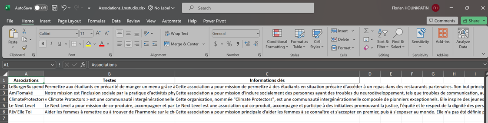

### b-	Fondations 
Dans un premier temps , nous cherchions de nous même des fondations variées capable de financer un bon nom d’associations différentes. Mais comme expliqué plus haut notre manque d’expérience a rendu cette tâche ardue et nous a ainsi poussé à demander à nos partenaires, qui s’y connaissent évidemment plus que nous, une liste de fondations pour travailler de la même sorte qu’ils nous avaient fourni des associations. Ils ont ainsi accédé à notre demande et nous ont donné une liste de 86 fondations 

Après avoir obtenu cette liste, nous devions tout de même visiter chacun de ces sites pour en étudier leur légitimité (vérifier que ce sont vraiment des fondations et qu’elles font des appels d’offres ou juste sont toujours actives) et faire du repérage sur la possibilité de scraping (Vérification de la présence ou non de cookies et étude de leur balises, vérification de la localisation des informations nécessaires …)

Scraping des textes des fondations

- Première idée

Dans un soucis d’automatisation complet du processus d’extraction d’information comme le voudrait le projet, nous avions d’abord opté pour une création d’un dataframe composé de colonne nom de fondations et urls. Nous avons utilisé le module selenium et sa dépendance webdriver pour interagir avec un navigateur (chrome) et effectuer les manipulations voulues. L’idée était avec ce dataframe de boucler sur chaque url et de récupérer le texte de la page x et de l’attribuer à une nouvelle colonne texte comme nous avons pu le voir plus haut avec le dataframe association.
Cependant, cette méthode était bien plus complexe à réaliser que ce que nous pensions pour les raisons suivantes : 

- Gestion des cookies 

Dès les premiers sites rencontrés, nous avons compris que le travail risquait d’être compliqué du fait de la différence visuelle et évidemment du point de vue de codes des cookies. Comme illustrés dans les images ci-dessous avec respectivement les balises html des cookies d’acceptations pour les fondations 1% for the planet et Akuo fondation.

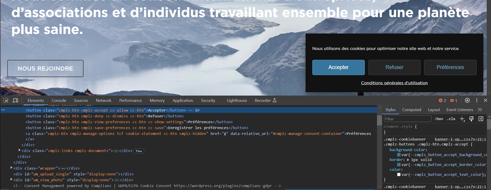


Ce problème implique qu’un code unique de gestion de cookies pour notre idée d’automatisation totale du processus d’extraction devenait impossible. Mais nous avons tout de même tenté de faire une esquisse de code de gestion de ces sites (voir ci-dessous).

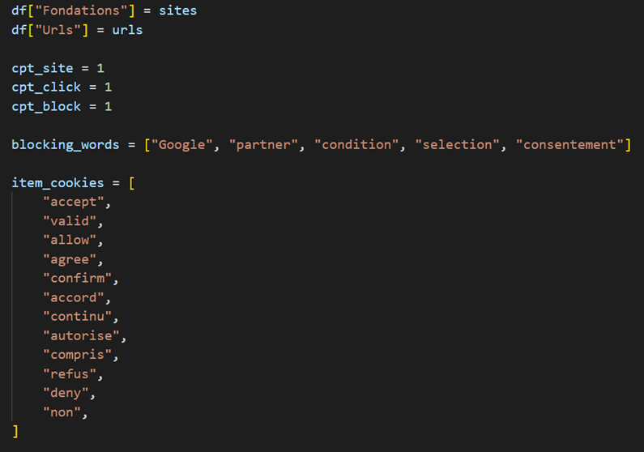

C’est bien évidement qu’une partie superficielle du code complet mais il s’agit ici simplement d’expliquer l’idée que nous avons eu (surtout qu’elle n’a pas fonctionnée comme nous l’espérions), les résultats obtenus et les conclusions que nous avons pu en tirer.
L’idée est que bien que le code derrière le click sur un bouton de cookies soit ‘’imprévisible’’, nous avons pu identifier des paternes dans la créations de boutons de cookies et avons basé toute notre stratégie dessus. Après étude individuelles des sites en possédant, nous avons pu émettre l’hypothèse que les cookies étaient toutes soient sous balise "button" ou "a", donc en se basant sur cette logique nous n’aurions qu’à produire un code qui nous permette d’interagir avec ces balises. Cependant, il nous manquait une information supplémentaire cruciale qui nous permettrait de reconnaitre le bouton cookie avec lequel nous voulons interagir, et quoi de plus évident que le mot « accepter » partagé sur une majorité de site pour une mettre sur la piste d’une bonne métrique. Cependant, loin d’être suffisant nous avons constitué une liste de mots couramment utilisés dans les boutons d’acceptations de cookies et l’avons mis dans une variable item_cookies à chercher dans le nom (L’ID ou la classe) de chacune des balises mentionnées plus haut pour effectuer un potentiel click (Voir exemple ci-dessous). Avec simplement cette procédure nous avons réussi à gérer 58 sur 65 sites (89%) possédant des cookies.

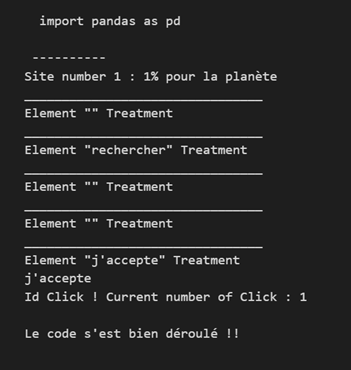

Soucieux d’expliquer le non-fonctionnement de notre méthode sur les 11% de sites restants nous avons fait une étude au cas par cas de chacun d’entre eux et avons fait des découvertes qui nous ont fait comprendre que notre seul code ne suffirait pas. En fait, il y a des boutons en arrière-plan qui contiennent des informations suffisantes pour être considérés comme des cookies bien qu’ils n’en soient pas en réalité. Et ce genre d’éléments fait stopper le code totalement et nous obtenons un ElementNotInteratableExecption. Nous avons créé une liste de blocking words qui sont des mots qui ne seront pas pris en compte pour le choix des boutons qui les contiennent et cela nous a permis de passer de 89% à 92% (60 sites) de cookies gérés. C’est un résultat satisfaisant mais sachant que le travail sera non supervisé par la suite il risque forcément de planter à un moment et nous ne pouvons décemment pas accepter cette éventualité surtout quand on sait que cette étape est la première d’un long processus qui n’a même pas été mentionnée tellement elle est considérée simple … 
Exemple de l’exception expliquée plus haut :

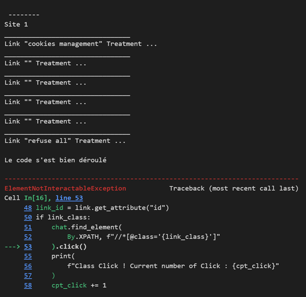

- Format des sites trop différents 

En parallèle des soucis rencontrés avec la gestion des cookies nous nous sommes projetés sur la suite du projet avec l’extraction des informations et vu que nous nous sommes plus ou moins bien formés à cela durant l’état de l’art nous n’avons pas spécialement rencontrés de problèmes à scrapper un site en particulier. Cependant, à nouveau, dans l’optique où il nous avait été demandé de concevoir un modèle automatique d’extraction de données de structuration d’appels à projets, nous devions traiter dans le même code à la fois des cookies et de l’extraction de texte uniformément pour tous les sites et autant nous avions deux type de balises pour les boutons pour les cookies, nous en avons au moins 4 pour les textes ce qui fait trop de d’imbrications dans les boucles et de conditions à prendre en compte pour l’implémenter dans un code unique. En plus, il y a le fait que toutes les informations dont nous avons besoin ne se trouvent pas sur la page principale.
Pour toutes ces raisons nous avons décidé de changer d’approche. 


- Idée finale

Comme expliqué précédemment nous n’avons pas pu mettre en place notre idée initiale, nous avons dû nous rabattre sur une option réalisable en gardant en tête de rendre le processus le plus automatisé possible.
La seule idée qui nous est venue en tête est la création d’un dataset qui sera créé par itération dans des classes qui correspondent respectivement à un site et auront de même respectivement des méthodes adaptés pour la gestion des cookies et le scraping du texte qui nous intéresse quelque soit sa position dans le site. Nous faisons également ces itérations dans des navigateurs isolés pour qu’en cas d’échec dans un site le processus continue avec le suivant …

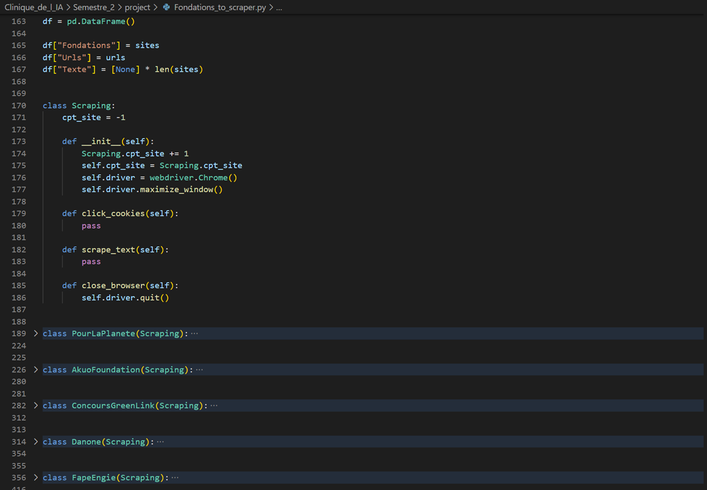

Après l’itération dans tout les sites et exécutions des tâches demandées, nous obtenons un dataframe du même format que celui fait pour les associations précédemment et stockées dans un Excel (Fondations.xlsx). (Voir ci-dessous).

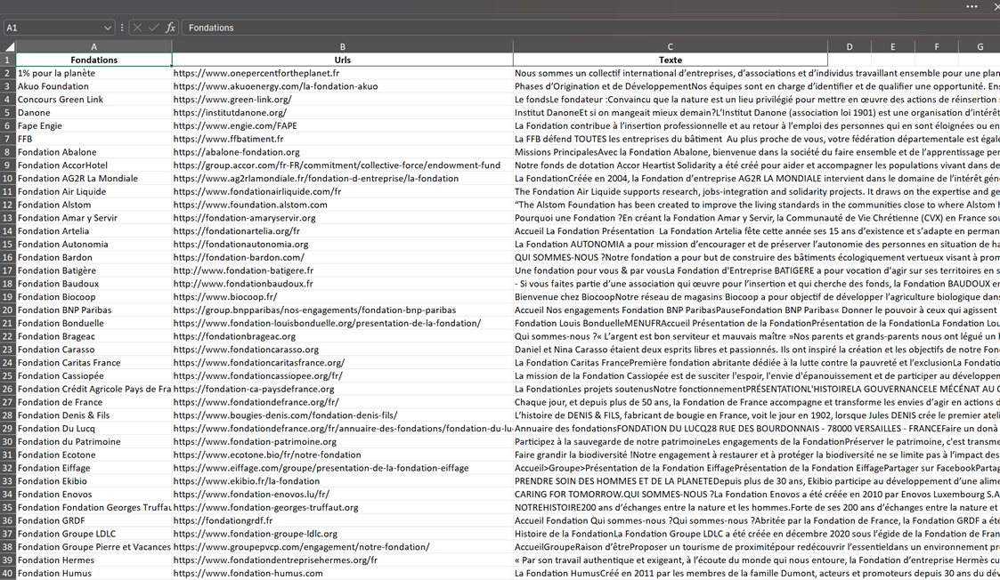

Ensuite pareillement que précédemment, nous fournissons chaque ligne de la colonne texte au llm et nous lui demandons d’en extraire les informations fournies par le partenaires (date butoir, don moyen, période de dépôt …) qui permettront de gérer le dépôt et suivi d’une demande de financement nous avons exporté le dataframe résultant  sous Excel par la suite (Fondations_Lmstudio.xlsx).

Les informations / colonnes demandées au modèles sont les suivantes : 

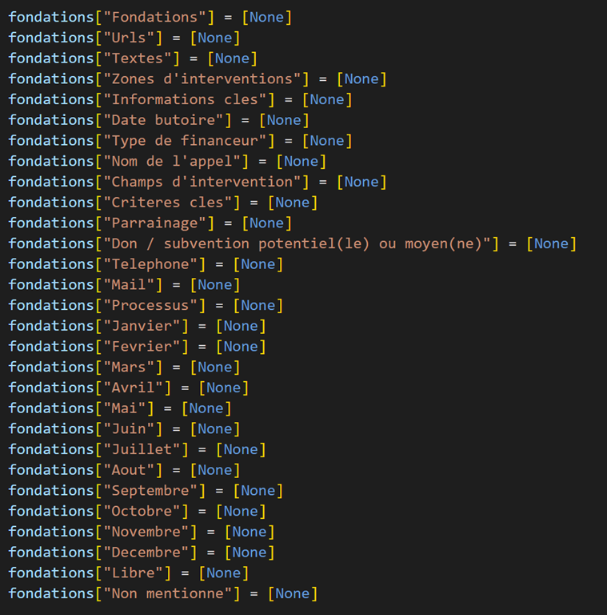

L’interprétation de l’importance des colonnes est compréhensible en se remettant dans le cadre du domaine expliqué dès le départ.
 
### c-	Pdfs

Arrivé en fin de projet, il nous restait assez de temps pour accéder à une demande supplémentaire de nos partenaires qui était le traitement de pdf pour en extraire le texte et faire le même processus de travail qu’avec des fondations. Ce n’est pas spécialement dur nous avons utilisé le module PyPDF2 et particulièrement sa classe PdfReader.

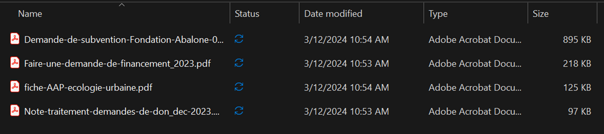
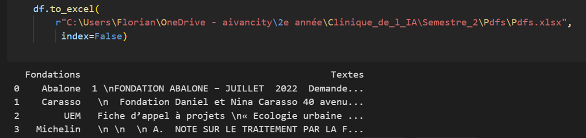

Après avoir obtenu cette base de données il suffit de la traiter comme montré plus haut avec les fondations. Les étapes 1 et 2 ainsi terminées, il ne reste plus qu’à passer à l’étape final du matching et juger des résultats obtenus.

## Matching
### TfidfVectorizer – NLP
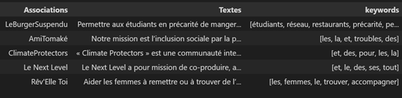

Modèle appliqué sur notre base de données

### Clé d’api

Pour faire les différentes étapes d’extraction et de traitement de textes. Nous avons eu pour idée d’utiliser un llm pour faire les différents traitements. Pour cela nous avons utilisé la clé d’api d’openai et la clé d’api associé. 
Nous avons rencontré un soucis concernant le pricing, cad l’utilisation de la clé est payante. Une des consignes de notre projet étant de rester dans un domaine gratuit, nous avons été contraints d’abandonner cette idée et de songer à une méthode plus simple et gratuite.

Voir ci-dessous un exemple d’utilisation du code avec le prompt et avec la clé d’api pour extraire les informations demandées. 

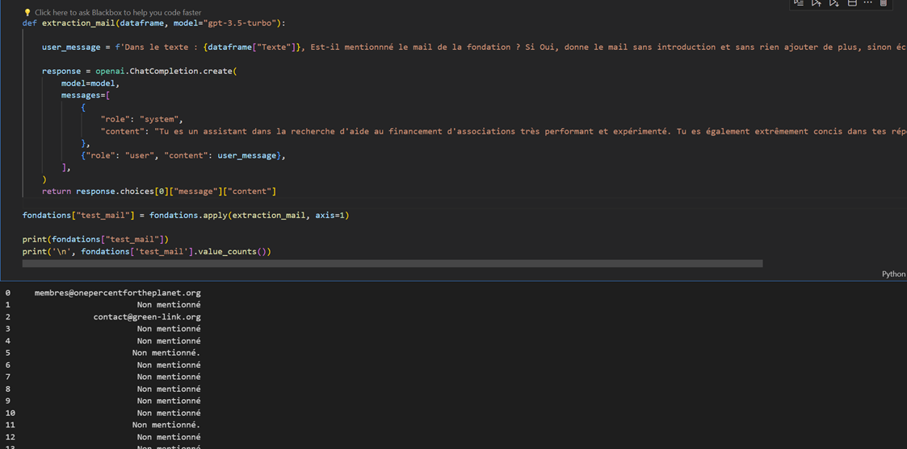

### Lmstudio

Pour éviter le pricing initié par l’utilisation de la clé d’api, nous avons décidé d’utiliser le llm localement pour faire les travaux demandés. Nous avons utilisé le modèle Mistral 7B par soucis d’exigence RAM.

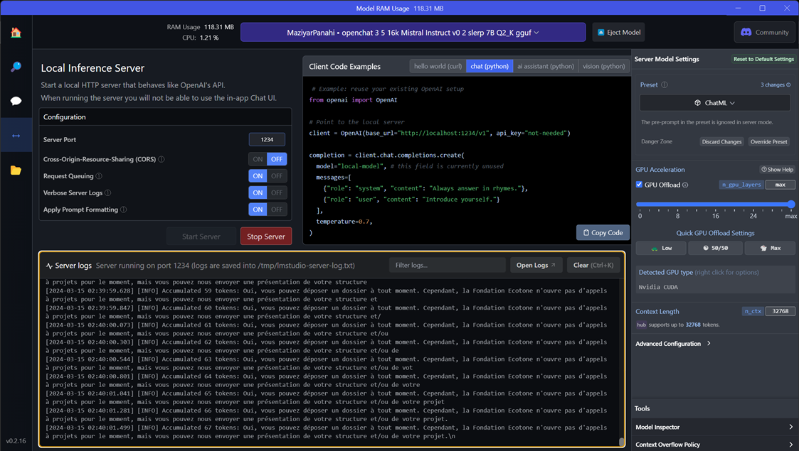

Cependant, cette méthode est extrêmement lente et demande des ressources logicielles trop importantes. Ce qui laisse envisager que la gratuité aurait ses limites concernant l’ampleur de ce projet.

Pour explication brève du code, on fait une analyse de chaque association à chaque fondations, on demande au modèle de statuer sur la possibilité de financement de l’association i par la fondation j. En cas de réponse positive, on ajoute la ligne entière d’informations a un dossier Excel portant le nom de l’association et ainsi de suite…

## Automatisation totale du processus.

Nos partenaires, nous ayant reproché le manque d’automatisation dans notre méthode expliqué précédemment, nous ont demandé une méthode plus automatisée qui leur permettrait d’interagir le moins possible avec le code et de pouvoir rechercher d’elle-même les fondations de champ d’interventions et de zones spécifiées.

Pour cela, nous avons pris l’initiative de créer une interface graphique pour répondre au besoin de ne pas toucher au code (Voir dessous).

Dans cette dernière, l’utilisateur n’a qu’à entrer les champs d’interventions, les zones géographiques, le nombre de fondations (pour un champ i dans une fondation j) et spécifier le chemin dans lequel le fichier excel résultat est créé avant de finalement lancer le code qui fait ladite recherche.
Nous allons créer un code annexe qui explique au partenaire le fonctionnement du code allant avec l’interface.

L’idée du code derrière le fonctionnement derrière le « fonctionnement » de ce code est basé sur notre toute première idée de gestion de cookies (Voir ci-dessous).
Nous sommes conscient d’avoir mentionné plus haut que ce code était « imparfait » et il l’est toujours cependant il a été modifié de sorte à ne plus faire crasher le code.

Nous avons utilisons des boucles imbriquées pour constituer le query sur lequel la recherche se basera pour ensuite récupérer les fondations résultantes (Nous en faisons un nettoyage superficiel en supprimant les réseaux sociaux et autres sites inintéressant cette liste sera surement à modifier par les partenaire en fonction de l’ampleur des recherches a faire).

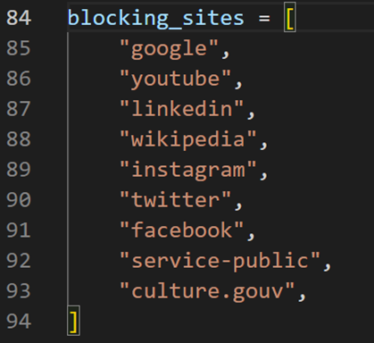

Ensuite avec selenium récupèrera le nombre de sites spécifiés de par l’interface et ensuite pour éviter de se répéter fera le même traitement qu’expliqué dans II-b fondations avec traitement par le llm…

## Résultats

### 1ère méthode : Fondations fixes

La sortie de notre code est la création d’un fichier Excel, du nom de l’association qui contient les informations des fondations qui matchent respectivement l’association considérée.

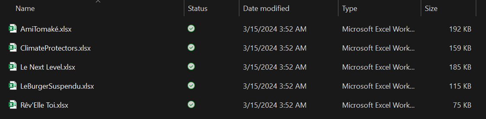
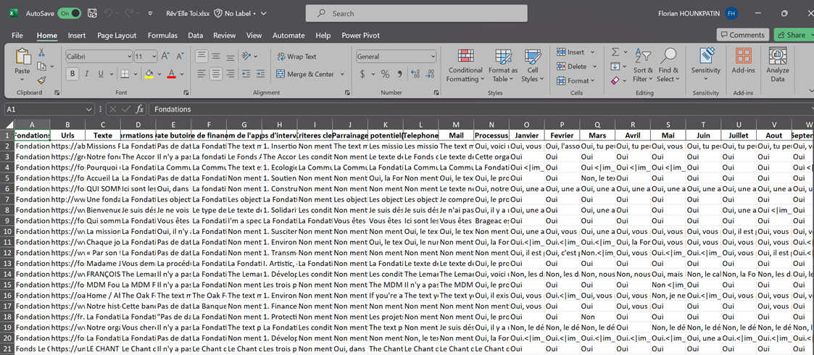

### 2e méthode : Base de données de fondations mobiles.

L’interface a pour but de créer à chaque fin de traitement de fondations, le fichier Excel mis a jour contenant les informations similaires à celles obtenues dans la méthodes précédentes. 

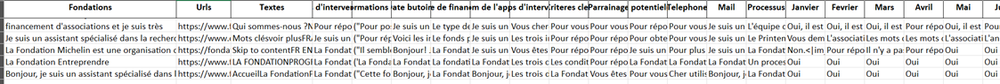

Nous obtenons un résultat similaire au précédent mais c’est principalement juste la méthode d’obtention de se dernier qui est différente.

# B- Explication du fonctionnement du code derrière l’interface graphique


## I / Utilisation de l’interface

#### Allumage de lm studio

Installation de lm studio : https://lmstudio.ai/ 

Manipulation

 
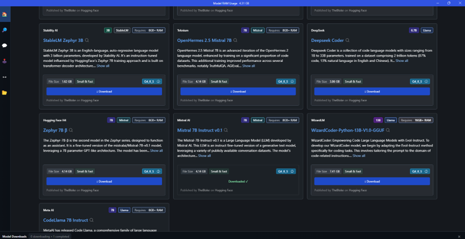
 
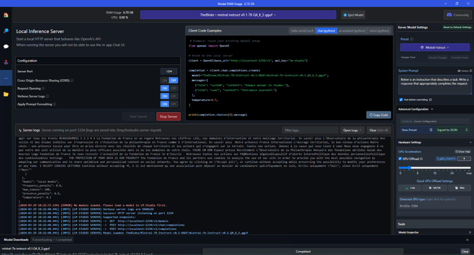

Nous avons téléchargé/utilisé le modèle « Mistral instruct V0.1 ». Mais selon vos performances logicielles vous pouvez opter pour un modèle plus puissant. Il faudra pour cela modifier le nom du modèle utilisé dans le code 

 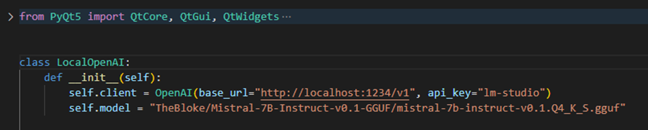

NB : Toute modification dans le code ne s’appliquera pas automatiquement dans l’exécutable (l’application), il faudra en créer un nouveau de la façon suivante (S’aider de GPT si besoin).

 
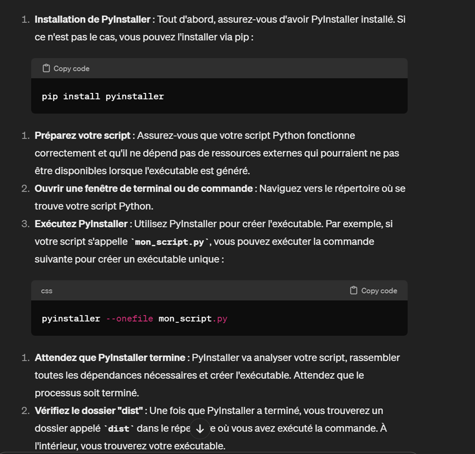

Nous avons défini un prompt général au modèle via le code, mais vous pouvez le repréciser depuis l’application si besoin (Voir-ci-dessous)

 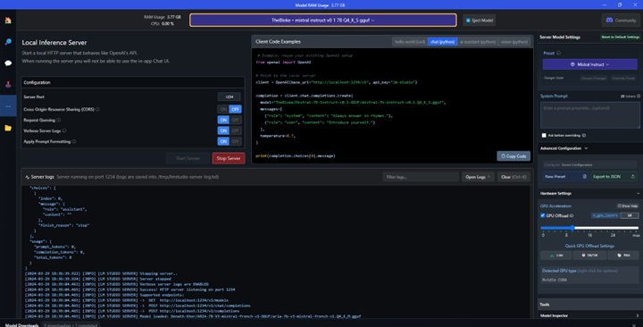


Pour ce qui est du format de la réponse, on vous recommande de tout effacer en préfixe et suffixe mais si besoin vous pouvez le modifier depuis l’application. Prendre en compte que nous avons limiter la taille de la réponse.

 
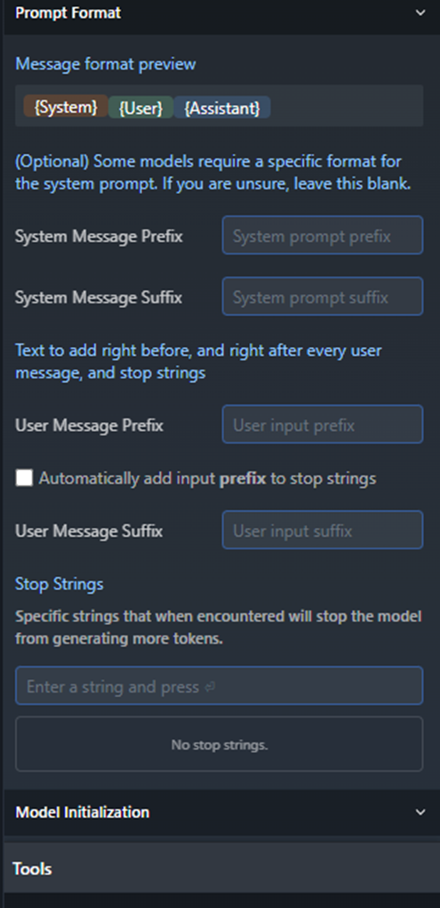
 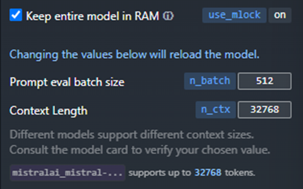

Nous recommandons cette configuration bien qu’elle n’ait pas de grand impact sur le résultat.

Enfin toujours dans dans lm studio, dans la partie « local server », appuyez sur « start server » avant de commencer la manipulation de l’interface graphique.

#### Interface graphique

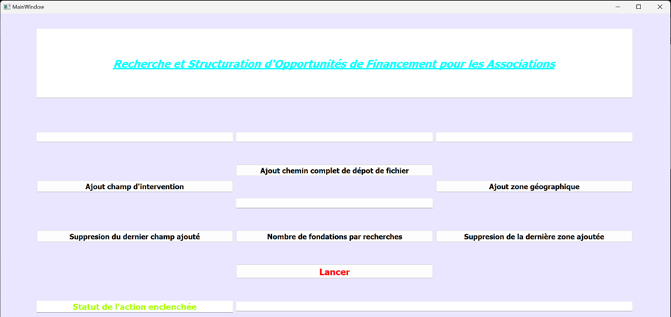


Au cas où le schéma ci-dessus n’est pas suffisant, l’idée était juste de montrer à quel champ de texte correspond quel bouton …

 

-	Le champ de texte à côté de « Statut de l’action enclenchée » affichera les erreurs principales / ou confirmation de réalisations liées au moment où l’on clique sur un bouton. Elles sont très claires et ne devraient même pas être rencontrées si la documentation est bien comprise.

-	Pour ce qui est de l’ajout d’un champ / zone, vous pouvez entrer n’importe quoi dans le champ de texte, nous n’avons pas mis de restriction de taille ou de type …
Le bouton « Suppression du dernier champ ajouté » permettra de rectifier une potentielle erreur d’entrée plutôt que de relancer à chaque fois le programme.

-	Pour le chemin entrez le chemin complet depuis la racine et rajoutez-y le nom du fichier et la terminaison « .xlsx »

 

Example Chemin final à adapter: C:\Users\KF23\...\ondations_Lmstudio.xlsx

Vous pouvez aussi simplement créer manuellement le fichier, faire clic droit dessus et « copier le chemin » … (« copy as path » en anglais). Le chemin ne contiendra pas de crochet.

Pas de restriction concernant l’entrée du chemin dans le champ de texte associé, mais assurez vous simplement de bien copier le chemin selon l’explication ci-dessus.

-	Le nombre de fondations pour chaque champs dans une zone. Il s’agit de la variable qui définira en grande partie la longueur du travail.

NB : Prendre en compte le fait suivant en lançant un code : 5 fondations pour 6 champs dans 6 zones données donneront une itération dans 6 * 6 * 5 = 180 fondations plus le traitement associé … Prendra relativement du temps …


## II / Documentation du code

Nous n’avons pas l’intention d’expliquer ici la totalité du code. ChatGPT et d’autres IA le feraient bien mieux que nous... Cependant, nous allons montrer quelles variables sont susceptibles d’être modifiées selon des besoins très spécifiques 

### 1-	Classe LocalOpenAI

Cette classe est à la base de l’appel du modèle de LLM, pour les traitement demandés soit le remplissage des colonnes 

 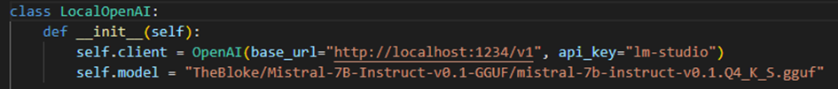

-	Si vous avez une clé d’API (d’openai de préférence, nous n’en avons pas testé d’autres même si nous supposons que le traitement pourrait être similaire) et que vous voulez l’utiliser pour rendre le code plus rapide et plus précis, il suffit de la mettre dans le champ api_key à la place de « not-needed » (ou quoi que ce soit d’autre Entre les crochets …) et de supprimer le base_url =…
Il faudra également ajuster le nom du modèle à utiliser en fonction de l’origine de la clé d’api utilisé (disponible depuis le site considéré ou via recherche google)

NB : Nous tenons a rappeler que nous nous pouvons en aucun garantir le fonctionnement de l’utilisation de l’API sur le long terme du fait des limitations par minutes / heures / jour.


 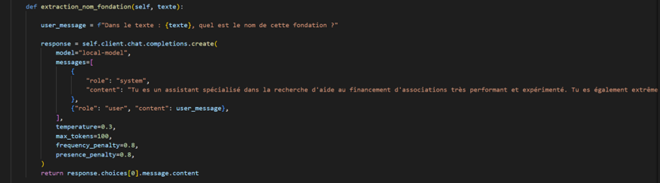

-	Dans le champ user_message se trouve le prompt donné au modèle pour le traitement, si vous voulez modifier la phrase, vous pouvez le faire directement
Vous pouvez également personnaliser la « personnalité » du modèle dans le champ content 

-	Dans le champ « … content : Tu es un assistant … », vous pouvez également personnaliser la « personnalité » du modèle et une partie de sa performance, nous avons mis une personnalité d’assistant spécialisé dans la recherche d’aide au financement d’associations … Si vous vous sentez plus inspirés que nous vous pouvez le modifier à votre guise.

Les paramètres du modèle

-	Température : Degré de créativité du modèle. Plus c’est grand plus il est créatif, et inversement il aura des réponses fixes à chaque lancement du programme. Nous avons mis 0.3 / 1 pour avoir des réponses plus précises avec un degrélimite de liberté.

-	Max_tokens : La taille de la réponse. Ne se compte pas en nombre de lettre. 100 pour permettre le monis d’égarement possible au modèle.

-	Frequency_penalty : Pénalité que l’on met au modèle ss’il se répète trop. Fixée à 0.8 pour permettre les meilleurs réponses possibles avec un degré d’erreur négligeable.

-	Presence_penalty : Pénalité que l’on met au modèle si sa réponse ne correspond pas à la personnalité demandée. Permet d’obtenir des résultats conformes à la personnalité fixée dès le départ. Fixée à 0.8 pour avoir les meilleurs résultats avec la personnalité demandée.

Ajout de colonne(s).

-	Vous pouvez de ce fait en principe être à même à ce niveau de créer une nouvelle colonne cependant pour le faire il faudra ajouter la ligne self.fondations[‘’nom_de_la_colonne’’] = [None] dans la classe UI_MainWindow dans la fonction setupUi à la ligne 836 avec les autres colonnes.

 
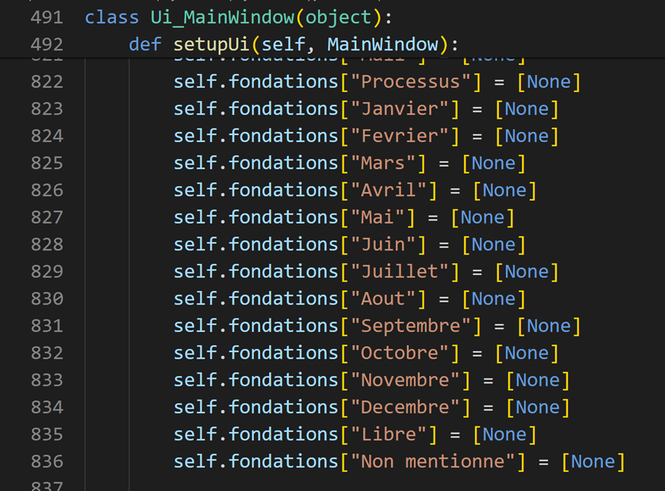

### 2-	Classe UI_MainWindow

La modification de cette classe n’est pas recommandée du fait de sa sensibilité sur le fonctionnement du code.

Toutes les autres fonctions n’ont pas à être modifiées à moins que vous ne soyez à même de modifier l’interface graphique via le code …

La seule fonction susceptible d’être modifiée est la fonction principale « run » et ses fonctions intégrées. Nous tenons à rappeler que la spécificité des sites peut ne pas supporter la moindre modification même justifiée du code : 

-	Click_cookies : fonction pour cliquer sur les cookies.
Vous pouvez ajouter des blocking_word (mot sur lesquels on ne clickera pas même si contenus dans les boutons rencontrés) ou des item_cookies (mot sur lesquels on clickera si contenus dans le bouton rencontré). Il n’est pas spécialement nécessaire de modifier cette partie du code sauf. 
 


-	Search : fonction pour lancer la recherche 
 
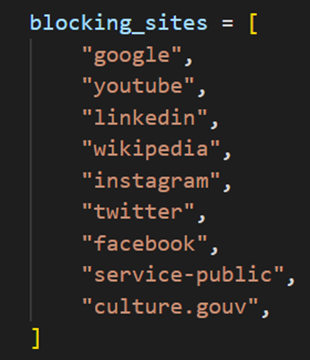

Vous pouvez ajouter des sites qui ne seront pas pris en compte dans la recherche.

-	Get_text : récupération du texte de la première page du code 
Nous ne recommandons pas de toucher le code pour cette partie à moins que vous n’ayez trouvé au préalable une meilleure méthode d’extraction, situation dans laquelle vous saurez parfaitement comment modifier le code…

Nous ne recommandons pas de modifier le reste du code car leur modification est assez sensible sur le fonctionnement qualitatif et physique de l’application.

Nous nous doutons que les résultats ne seront pas forcément à la hauteur mais il s’agit d’une première version qui pourrait servir de support pour son amélioration voire sa concrétisation au degrés de précision attendu.

## Suite de projet

- Gestion des projets par pdfs.

Nous avons pu traiter de façon séparée, l’extraction du texte des pdfs. Qui sera par la suite fourni aux autres codes pour l’extraction d’informations et le matching. 

- Gestion des projets par vidéos 

Nous n’avons pas pu mettre en place un modèle pour la gestion des textes contenus dans les vidéos. Cependant, nous avons fait des recherches pour voir quelles seraient les options pour résoudre un tel problème. Voici les possibilités trouvés

Malgré ces options nous n’avons pas trouvé de moyen de reconnaitre de façon automatique les différents éléments sur un site donné que ce soit (pdf, image, vidéo). Cependant, nous envisageons que l’application d’un modèle de recognition d’images, pdfs, vidéos / téléchargement de ces données permette l’identification de ces dernières avant traitement de chacune d’entre elles avec un code qui les traite de façon unique et précise (il suffira de compléter ce code avec un code d’extraction de texte.). 

- Systèmes d’alerte

Nous n’avons pas été à même de créer un modèle d’alerte par mail ou par numéro de tel mais il est largement possible de le faire avec le module smtplib. 

Le modèle que nous avions l’intention d’implémenter est la suivante.

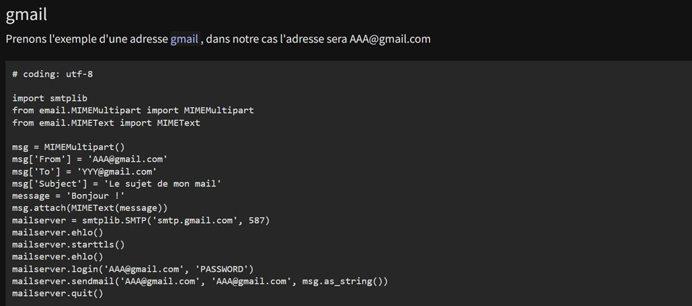

Il suffit d’ajouter comme conditions de mettre l’entrée de 5 nouvelles fondations par exemple dans la base de donnée et d’envoyer un mail à la personne considérée. 

- Hébergement.

Comme on pourrait l’imaginer, le fichier en création n’est pas consultable pendant le processus ce qui rend l’utilité de cette application discutable. Une suite sur ce projet serait la mise en place d’une base de données en ligne stockée et gérable via SQL. Nous pensions a apache mas nous ne sommes pas assez expérimenté pour pouvoir trouver d’autres alternatives pour l’instant. 

## Conclusion

En fin de projet, j'ai été à même de répondre à la thématique de création d’un système automatisé de collecte et de structuration d’opportunités d’appels à projets pour des associations. La qualité  du rendu est discutable mais je pense avoir posé une base importante au projet pour permettre son évolution par la suite si les aspects financiers et techniques mentionnés plus haut sont bien pris en compte par le partenaire ou tout autre personnes susceptibles de poursuivre ce projet. j'ai pu, dans ce projet, mettre en pratique un grand nombre de compétences apprises dans nos cours ou via nos expériences professionnelles et personnelles. 

